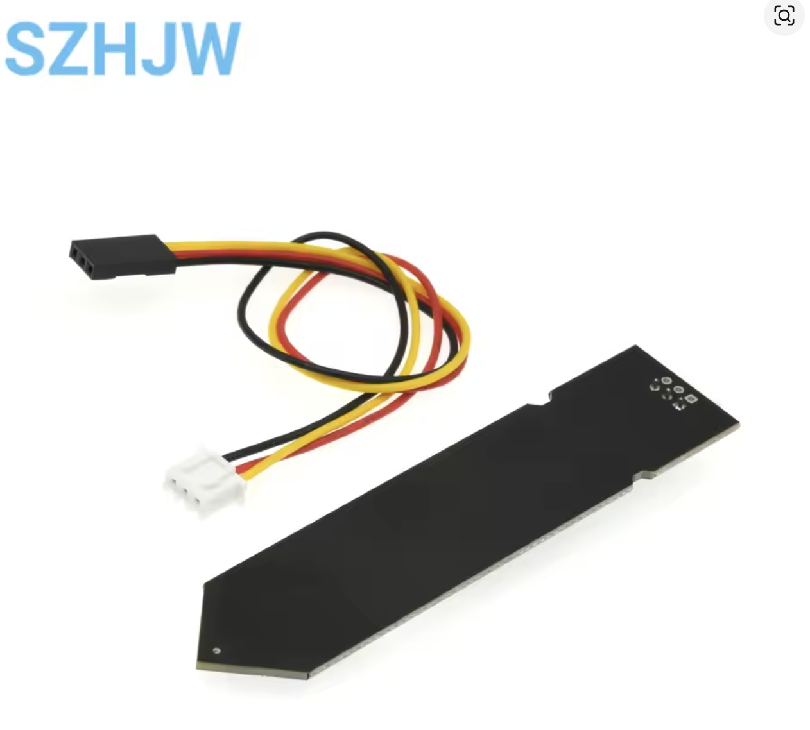
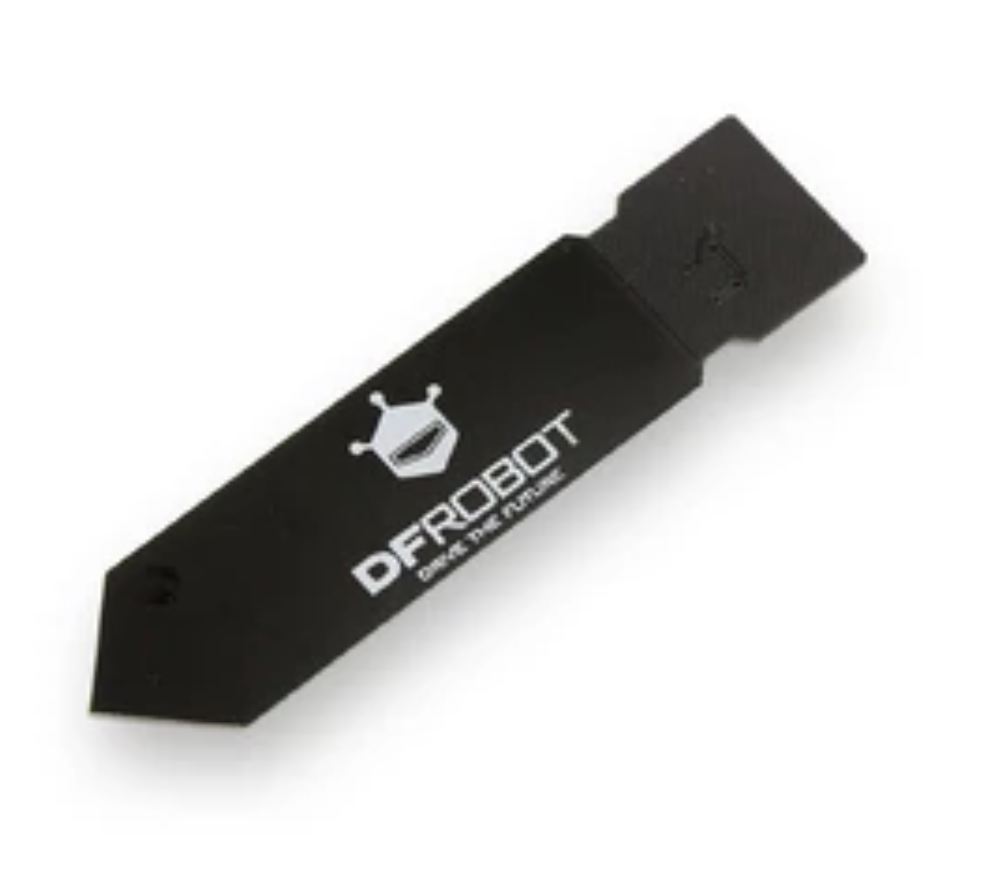
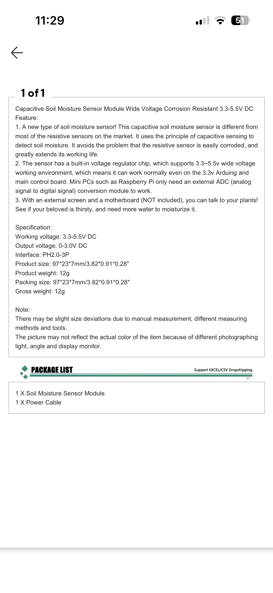
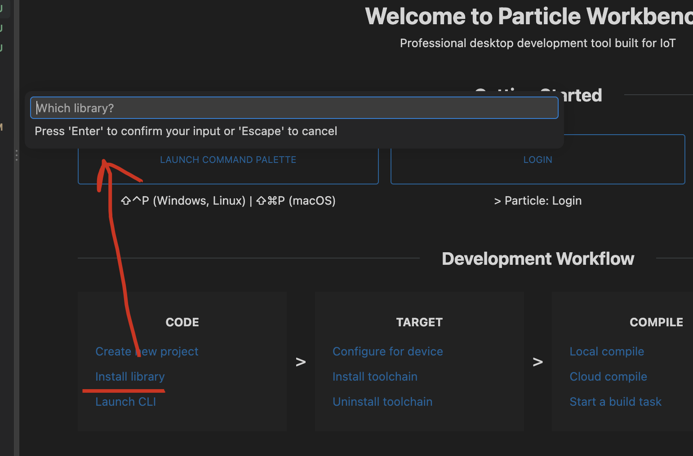
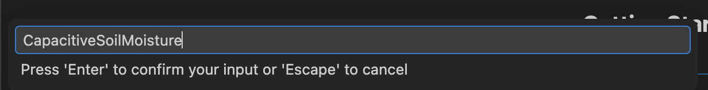
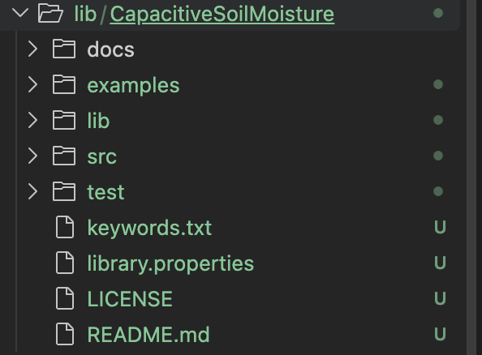

# Capacitive Soil Moisture

A small C++ driver for Arduino-compatible boards and the Particle Photon 2. It
supports generic three-wire analog capacitive soil-moisture probes (3.3-5.5 V
supply, analog voltage output). These sensors do not use I2C, SPI, or UART: the
signal wire connects directly to an ADC pin.

## Sensor used for this project

<a href="https://a.aliexpress.com/_mqTECgj"></a>

- [Original AliExpress product listing](https://a.aliexpress.com/_mqTECgj)
- Listing specifications: 3.3-5.5 V supply, 0-3.0 V analog output, PH2.0-3P
  connector, approximately 97 x 23 x 7 mm.
- The closest documented name-brand match is the
  [DFRobot SEN0193](https://wiki.dfrobot.com/sen0193).

### DFRobot SEN0193 reference

This is the DFRobot-branded sensor. It is electrically compatible, but it is
not the SZHJW sensor pictured above.

<a href="https://wiki.dfrobot.com/sen0193"></a>

<details>
<summary>Original seller specification screenshot</summary>



</details>

## Compatible sensors

The driver works with a sensor when its measurement is presented as an analog
voltage that stays between 0 and 3.3 V at the Photon 2 ADC pin. It supports
either direction: the reading may rise or fall as the soil gets wetter. Every
individual probe still needs dry/wet calibration.

These online sensor families have manufacturer documentation confirming a
compatible analog output:

| Sensor | Type and interface | Photon 2 notes |
| --- | --- | --- |
| [Generic SZHJW / Capacitive Soil v1.2-style probe](https://a.aliexpress.com/_mqTECgj) | Capacitive, 0-3.0 V analog, 3.3-5.5 V supply | Directly compatible; power from `3V3` |
| [DFRobot Gravity SEN0193](https://wiki.dfrobot.com/sen0193) | Capacitive, 0-3.0 V analog, 3.3-5.5 V supply | Directly compatible; closest documented match to this project's probe |
| [DFRobot Gravity SEN0308](https://wiki.dfrobot.com/sen0308) | Waterproof capacitive, 0-2.9 V analog, 3.3-5.5 V supply | Directly compatible; follow its four-wire grounding instructions |
| [Seeed Grove Capacitive Moisture Sensor](https://wiki.seeedstudio.com/Grove-Capacitive_Moisture_Sensor-Corrosion-Resistant/) | Capacitive, analog output, 3.3/5 V supply | Compatible; power from `3V3` and connect Grove `SIG` to `A0` |
| [SparkFun Soil Moisture Sensor SEN-13322](https://www.sparkfun.com/sparkfun-soil-moisture-sensor.html) | Resistive, analog output, 3.3-5 V supply | Compatible; power from `3V3`; wet values normally rise instead of fall |
| [SparkFun gator:soil](https://learn.sparkfun.com/tutorials/sparkfun-gatorsoil-hookup-guide/all) | Resistive, analog output, 3.3-5 V supply | Compatible; power from `3V3`; intended mainly for classroom use |
| [Seeed Grove Moisture Sensor](https://wiki.seeedstudio.com/Grove-Moisture_Sensor/) | Resistive, analog output | Compatible when powered from `3V3`; wet values normally rise |
| [Vegetronix VH400](https://vegetronix.com/Products/VH400/) | Professional probe, 0-3.0 V analog output, 3.5-20 V supply | Signal is ADC-safe, but **do not power it from `3V3`**; use `VUSB`/regulated 5 V or an external supply and join the grounds |

Marketplace names change frequently, so no fixed table can enumerate every
clone. An unlisted sensor is compatible if all of these are true:

1. It has a raw analog-voltage output, often labeled `SIG`, `AO`, or `AOUT`.
2. That output never exceeds the Photon 2 ADC range of 0-3.3 V.
3. Its power requirement can be met without powering it from a Photon 2 GPIO.
4. It has a common ground with the Photon 2.

I2C/Qwiic/STEMMA sensors, UART, RS-485, SDI-12, frequency-output sensors,
4-20 mA transmitters, and modules that expose only a digital `DO` threshold
output are **not** compatible with this driver. A module with both `AO` and
`DO` is compatible through `AO` if its voltage is safe.

## Wiring

| Sensor wire | Microcontroller |
| --- | --- |
| Red / VCC | 3.3 V or 5 V, within the sensor and board limits |
| Black / GND | GND |
| Yellow / signal | ADC-capable analog input |

The sensor described for this project has a 0-3.0 V output. Confirm that this
does not exceed the ADC input limit of your board. Never put 5 V directly into
a 3.3 V-only ADC input. Do not immerse the electronics at the top of the probe.

## Particle Photon 2

For the Photon 2, use this wiring:

| Sensor wire | Photon 2 |
| --- | --- |
| Red / VCC | `3V3` |
| Black / GND | `GND` |
| Yellow / signal | `A0` |

The Photon 2 ADC is 12-bit: `analogRead()` returns 0-4095 for 0-3.3 V. The
probe's specified 0-3.0 V output is within that range. `A0`, `A1`, `A2`, and
`A5` are dedicated analog pins. `A3/D0` and `A4/D1` can also read analog input,
but they are shared with I2C, so `A0` is the uncomplicated default.

The C++ Photon 2 application is
[`examples/ParticlePhoton2/ParticlePhoton2.cpp`](examples/ParticlePhoton2/ParticlePhoton2.cpp).
Build it for `P2` / Photon 2 with Device OS 5.0.0 or later.

### Install in Particle Workbench for VS Code

The public Particle library name is `CapacitiveSoilMoisture`. Open your
Particle application project in VS Code before installing it; do not install
the library into a checkout of this library's own source repository.

1. Open the Particle Workbench welcome page and click **Install library** under
   **CODE**. You can also open the Command Palette and run
   **Particle: Install Library**.

   

2. Enter `CapacitiveSoilMoisture` and press **Enter**.

   

3. Workbench installs the library under
   `lib/CapacitiveSoilMoisture` in your application project.

   

Include it in application code with:

```cpp
#include "CapacitiveSoilMoisture.h"
```

## Arduino

Copy this directory into the Arduino libraries directory, restart the IDE, and
open `File > Examples > Capacitive Soil Moisture > Calibration`.

Both forms are included:

- `examples/BasicReading/BasicReading.ino` for the Arduino IDE.
- `examples/ArduinoCpp/ArduinoCpp.cpp` for a C++/PlatformIO-style application.

## Calibration

1. Upload the `Calibration` example, or temporarily print `soil.readRaw()` in
   the Photon 2 application.
2. Record the stable reading with the probe in representative dry soil.
3. Record the stable reading in representative saturated soil.
4. Put those values into the constructor used by `BasicReading`:

```cpp
CapacitiveSoilMoisture soil(A0, dryValue, wetValue);
```

The library maps the dry endpoint to 0% and the wet endpoint to 100%, then
clamps readings outside that range. Calibration is empirical: the result is a
relative moisture percentage, not laboratory volumetric water content.

## API

```cpp
soil.begin();
int raw = soil.readRaw();
float percent = soil.readPercent();
CapacitiveSoilMoisture::Reading both = soil.read();
soil.setCalibration(newDryValue, newWetValue);
```

`read()` is preferred when both values are needed because it samples the probe
only once. The default is 10 samples separated by 5 ms. Passing equal dry and
wet endpoints marks the sensor as uncalibrated and returns `NAN` for percent.

## Native test

With a C++ compiler installed:

```sh
c++ -std=c++11 -Wall -Wextra -Werror \
  -Itest/native -Isrc \
  src/CapacitiveSoilMoisture.cpp test/native/test_driver.cpp \
  -o /tmp/capacitive-soil-test
/tmp/capacitive-soil-test
```

## License

Copyright (c) 2026 Isabella Wu. Released under the [MIT License](LICENSE).
